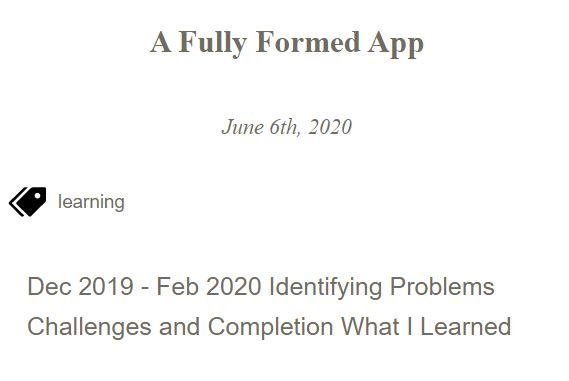
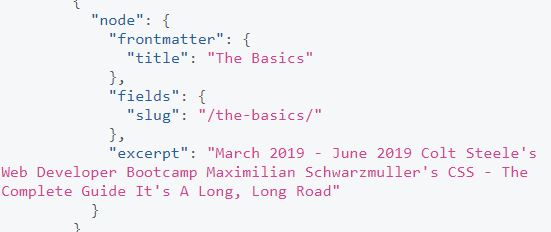

####gatsby-transformer-remark
 
 

As I mentioned in my last post, I've finished up detailing the beginning of my self-teaching.  It was mostly a roundup of courses I've taken so far, as well as a little look into a few projects (ones that would make the cut of being included in a portfolio, at least).
 
 
Now I'm looking to continue on with the other goal of this blog: detailing one new thing I've learned about coding each day.  I think it will be good to force myself to think about it and write something down, no matter how small.
 
 
I say that, though of course I wish I could write about some brand new, huge revelation or concept I've mastered every time I write a post.  Today wasn't like that, unfortunately.  I did a few pieces of maintenence work on code I've already written, and other aspects of life kept me busy for the day and unable to do a deep dive into anything.
 
 
So I guess today is a real proof of concept.  This won't be anything amazing or impressive, but I'm going to write about one, small thing I sat down and tried to learn. 
 
 

####Markdown and Gatsby
 
 
One big reason I enjoyed learning Gatsby and applying it to my personal portfolio site was that it was my first chance to use markdown files.  They're not all that impressive all by themselves, but I really liked the fact that they're not gated off behind having to learn some language.  Hypothetically, if I freelance for a client and they want to include a blog on their site, I don't think it'd be too huge a leap to show them markdown, and be able to use that as a way to dynamically load new content for them, without them having to wait for me to code anything at all.
 
 
This blog's formatting is very simple, though that's partially by design.  The course I took for gatsby detailed one plugin in particular, gatsby-transformer-remark, as a way to hook up your own markdown files to a Gatsby project's baked in GraphQL.  It didn't go into too much more detail than setting up an initial query and editing the gatsby-config and node files. 
 
 
Gatsby has excellent <a href = "https://www.gatsbyjs.org/packages/gatsby-transformer-remark/">documentation</a>, so I'll use that to try and tackle one new, small thing I can learn.  Today, I'm going to try and fix the formatting of my blog's main <a href = "/blog">posts</a> page: namely, the ugly formatting I've currently had in the blog snippets.  What seems to be happening is that when I include other markdown syntax for things like titles, ala "####Title", and so on, the excerpt for the snippet is simply those pieces of code.  Strange!  Further, it only seems to do it when I include a "####" type title at the top of the post, but not if I go write into writing.  It's not a matter of whitespacing or character limits, either:
 
 

 
 
Because in the example above, it ONLY shows the headers and skips the text thats in between.
 
 

####What I Learned
 
 
Checking the GraphQL query next, by running a few searches and expanding the prune length, it seems like my first observations were true:
 
 

 
 
So what can I do about it?  Checking the documentation, it seems like there are a few ways to go.  I don't want to limit myself to not having a markdown header at the top of the blog post.  By the way I currently write it, I have a title, an image, a subtitle, and then go into the post.  Sometimes I start with a markdown subheader, and sometimes I don't.  I should be able to do that, right?  And hard-coding it, or rather just writing it around that 'bug' seems like cheating.
 
 
gatsby-transformer-remark's documentation mentioned that it uses <a href = "https://github.com/jonschlinkert/gray-matter">gray-matter</a> to parse the frontmatter fields, which it uses within the MarkdownRemark queries.  Reading <em>it's</em> documentation, it turns out I did know it, it's where I populate my fronmatter fields for the query.  Well, I could just add an excerpt field, and then bypass the default excerpt query altogether.  That's one option, but it feels more organic to me to have the excerpts be x amount of characters, starting with the first paragraph, and excluding any subheaders.  So let's try to do that.
 
 
So, my first thought is to add a frontmatter field of "snippetText" (just to avoid any confusion of having excerpt misinterpreted).  By default, I'll load in the first paragraph of every post.  Then I'll use a javascript string method in the snippet component to parse it down to a set number of characters.  A little more manual work, but that's what fine tuning's all about, right?