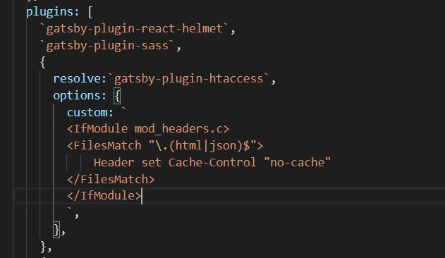
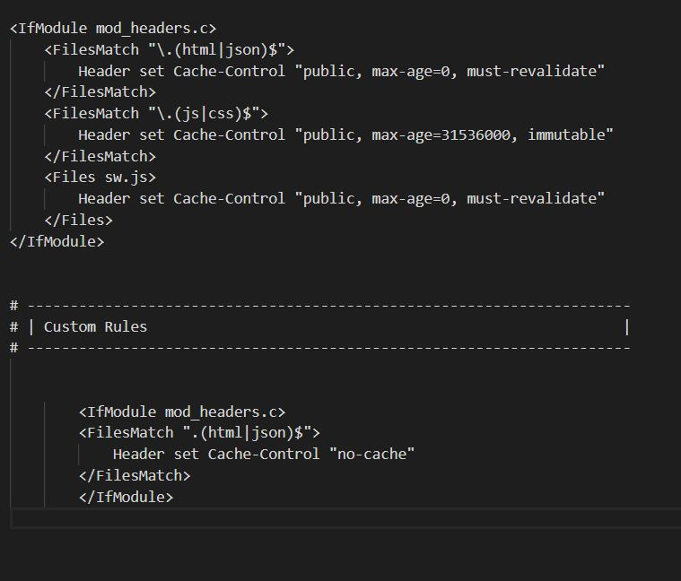

 
 
Today, I spent a ton of time on the full authentication via Firebase boilerplate I mentioned in <a href = "/posts/firebase-auth-1/">yesterday's post</a>.  What was meant to be a quick little diversion has instead gotten my full attention !  I finished a small version that works essentially as I outlined yesterday, but after reading a bit of a few different pieces of documentation and the absolutely <a href = "https://www.robinwieruch.de/complete-firebase-authentication-react-tutorial">excellent tutorial</a> by Robin Wieruch on the subject, I decided to spend some more time on it and make it even more robust and feature filled.
 
 
So, instead of writing about that while it's still being worked on, I decided I'd write about a few other things I learned and worked on today.
 
 

####Cache and Self Hosting
 
 
Until this website, I had never put any of my coding projects on a custom domain or hosted through anything other than the common, free platforms (Heroku, Firebase, Netlify).  I've hosted apps on each one of those and honestly, they're all great.  It's truly incredible what's available to use nowadays.  
 
 
But if for no other reason than I just think a web developer should know how to implement some paid-for hosting, I decided to use my personal portfolio + blog site as my test case.  Further (and maybe this is just wishful thinking), prospective employers might take me a tiny bit more seriously if my site is derekpyledev.com rather than derekpyledev.herokuapp.com. 
 
 
As I do with almost anything I'm trying to get opinions on, I searched for things like "best hosting platform", etc, on various developer subreddits.  After a bit of searching, I decided on SiteGrounds.  Seemed like a good mix of features vs price.  
 
 
After a little bit of fiddling with the FTP server, it was easy enough to get my site up and running and moved over from its former hosting (heroku).  As mentioned elsewhere, this project was done with Gatsby, so that definitely made it simpler given it's all about static pages and content, but I'm confident that a normal React or MERN, etc, app wouldn't be too difficult to put up.  
 
 
One issue I noticed afterwards, though, is that when I would re-build the app and push the new content (a new blog post for example), it wouldn't update on the live site.  First, I worried that this host didn't update whatever files I had internally until after X amount of time.  However, after a little googling, I figured out it was a cache issue.
 
 
At first, I "solved" this by manually flushing my browser's cache after each post and voila, the new post would be there.  That's not very good practice though, is it?  I doubt I have any daily readers at all (and maybe never will), but you'd want them to see your new content without having to do any configuration whatsoever.
 
 
So today I decided to fix it.  From Gatsby's documentation and then verifying on SiteGround, it seems I needed to config something in an .htaccess file in the base of my app.  I wrote one and spun it up and it seemed to work, but this is Gatsby!  There's a plugin for everything!
 
 
From <a href = "https://www.gatsbyjs.org/packages/gatsby-plugin-htaccess/">Gatsby's Documentation</a>, you just plop it into your gatsby-config and it automatically outputs a /public/.htaccess and a /public/static/.htaccess on every build.  Further, even without any configuration, it will include Gatsby's recommended headers.  Those work perfectly for what I wanted to do, but of course, this offers tons of fine-tuning options.
 
 

####UPDATE - 6/11/20
 
 
At first, and after posting yesterday's (this) blog post, it seemed as if that had worked for what I needed.  Unfortunately, for some reason after the first reload, it reverted to previous behaviour of seeming to load the posts from cache (same on my phone's browser).  Checking the .htaccess, the rules seemed to match what Gatsby recommended.  However, after editing and attempting a different fix -- namely, setting Header Cache-Control to "no-cache" instead, seemed to do the trick.
 
 
Now, since I mentioned using the gatsby-plugin-htaccess to take advantage of it building a /public/ and a /public/static .htaccess for me, I needed to test how to implement that in the plugin itself.  Reading its documentation, I tried to add a custom rule:
 
 

 
 
Now, as expected, the build creates the .htaccess like such:
 
 

 
 
Now the test is to see if the custom rule will overwrite the previous Cache-Control -- which is not a hard fix, but I'd rather automate if possible rather than having to edit that file every time.  Of course, I could just copy the .htaccess, remove the plugin, and use that for all future builds, but I'd rather try and see if I can implement this fix this way.
 
 
Looks like its working!  This was frustrating, so I hope anyone else implementing a blog in this way with the same issue can employ this fix.

####File Architecture
 
 
I've done a million coding courses, and every single one of them has different file architecture conventions.  There's some crossover, of course, but is it filename.component.js?  FileName.js?  /components/componenttype/componentname.js?  /components/componentname.js?
 
 
I came across one I hadn't seen yet, myself, which were separate nested folders for each component, and then exporting the necessaries from that component's specific index.js.  I thought that was pretty interesting -- that's how I've always written my redux files, for one.  I'm going to try out that architecture for a while. 
 
 
Maybe I'll change my mind in the future, but honestly, I think just write and organize whatever's most logical to you (for your own apps, of course).  When you want to revisit your code 4 months after putting it down, what's going to make the most sense to you when you're trying to flow through?
 
 
